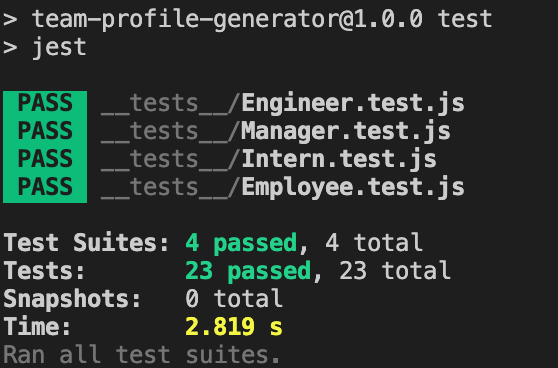

# Team Profile Generator
Project Owner: Aaron Au Yoong

[](https://choosealicense.com/licenses/mit/)

## Table of Contents
* [Description](#Description)
* [License](#License)
* [Installation](#Installation)
* [Usage](#Usage)
* [Contributions](#Contributions)
* [Credits](#Credits)
* [Tests](#Tests)
* [Questions](#Questions)

## Description
This is a Node.js command-line application that takes in information about employees on a software engineering team, then generates a HTML webpage that displays summaries for each person.

The application will be invoked by using the following command:

```bash
node index.js
```

The below illustrates the directory structure for this application:

```md
__tests__/			// jest tests
  Employee.test.js
  Engineer.test.js
  Intern.test.js
  Manager.test.js
dist/               // rendered output (HTML) and CSS style sheet
lib/				// classes
src/				// template helper code
index.js			// runs the application
```

## License
MIT License
Copyright (c) 2021-Present Aaron Au Yoong. All rights reserved.

## Installation
1. Download the `team-profile-generator` into your local device. 
2. Install npm basic packages. 
3. Install the inquirer npm package.
4. Ensure that the the jest npm package is installed, and it is displayed in the `package.json` file as:

```md 
"scripts": {
    "test": "jest"
  },
```
## Usage

[Video Demo](https://youtu.be/Xw_mc-CcbFU)
<br>
For reference, the result of the demo is the file `newTeamProfile.html` located in the dist directory.


1. Ensure you have all the files from `team-profile-generator` downloaded into your system.

2. Ensure you have npm packages installed. You may do so via executing the following command in your CLI (Command Line Interface):
```bash
npm init
```

```bash
npm i -y
```

Most importantly, ensure that you install the inquirer package:

```bash
npm i inquirer
```

3. To run the application, please enter the following into your CLI:
```bash
node index.js
```

4. Answer the questions that appear to add all team members to your team profile.

5. Once all team members are added, please answer "No" to the question "Would you like to add another team member?" to generate the HTML.

6. Upon completion, the readme will be generated as `newTeamProfile.html` in the dist directory, in your local folder `team-profile-generator`. 

7. Success! You may now use the generated HTML.

8. If you plan on moving the generated HTML output elsewhere, please remember to move the `style.css` stylesheet and place it in the same intended location. This is because the `style.css` stylesheet is REQUIRED for the webpage to display as intended. 

## Contributions
For contributions, you may follow the industry standard: [Contributor Covenant](https://www.contributor-covenant.org/)

## Credits
License badges used in this project were retrieved from GitHub user's `lukas-h` license-badge markdown file: [Markdown License badges](https://gist.github.com/lukas-h/2a5d00690736b4c3a7ba)

## Tests
This application includes the classes `Employee`, `Manager`, `Engineer`, and `Intern`. The tests for these classes are located in the `_tests_` directory. 

All tests passed. Please view below screenshot for test results:
<br>
<br>

<br>
<br>


## Questions
Any questions? Feel free to contact me via my GitHub profile: [Aaron Au Yoong's GitHub Profile](https://github.com/aaronauyoong)
